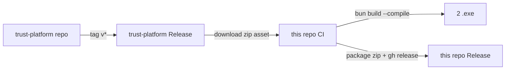

# ADR-001: Cross-Repo LSP Release Pipeline

```yaml
# Metadata
status: Accepted
date: 2026-07-02
deciders: maintainers
context: release pipeline design for ST-graph-rag-mcp v3.0.0
```

## Context

`ST-graph-rag-mcp` (this repo) is a TypeScript MCP server that shells out to `trust-lsp.exe` — a Rust LSP implementation living in a sibling repository (`boogy777-lgtm/trust-platform`). The release pipeline must produce a self-contained zip containing:

1. `st-graph-rag-mcp.exe` (Bun-compiled from `src/index.ts`)
2. `obsidian-export.exe` (Bun-compiled from `src/cli/obsidian-export.ts`)
3. `trust-lsp.exe` (Rust binary from `boogy777-lgtm/trust-platform`)
4. Configuration: `opencode.json`, `README.md`, `LICENSE`

The LSP binary historically was either downloaded from `trust-platform` releases (per `scripts/setup.ts:48-72`) or compiled locally from the git submodule (per `scripts/setup.ts:125-173`). Both paths had friction:

- **Download path** depended on trust-platform cutting a release
- **Local compile path** required Rust toolchain on every CI runner, adding ~10 min cold cache + toolchain management

## Decision

Adopt a **two-repo release pipeline**:



1. **`boogy777-lgtm/trust-platform`** owns `lsp-release.yml` — runs on its own tags, publishes `trust-lsp-win32-x64.zip` as a release asset.

2. **`boogy777-lgtm/ST-graph-rag-mcp`** owns `release.yml` — runs on its own `v*` tags, downloads the LSP zip from `trust-platform/releases/latest`, then runs `bun run build`, then publishes a release here.

The submodule `.gitmodules` remains for local iteration; CI explicitly does NOT initialize it (`submodules: false`).

## Consequences

### Positive

- **Build isolation** — Rust toolchain lives on `trust-platform` runners; this repo's CI only needs Bun (~30 sec setup).
- **Independent versioning** — `trust-platform` can ship v1.1.0 without forcing a release of ST-graph-rag-mcp. ST-graph-rag-mcp picks up the latest automatically (`/releases/latest`).
- **Reproducibility** — every release artifact can be traced: tag → zip → SHA → source commit. `softprops/action-gh-release` produces immutable URLs.
- **Failure localization** — if release pipeline breaks, the failing repo is obvious from the GitHub Actions list.

### Negative

- **Cross-repo coupling** — if `trust-platform` publishes a breaking LSP, every subsequent ST-graph-rag-mcp release silently picks it up. *Mitigation:* CI smoke runs `bun run smoke` (binary-level); application-level integration is covered by `bun test` (e2e pipeline). Future hardening: add a contract test that exercises LSP endpoints before publication.
- **Trust-lsp release must exist** — ST-graph-rag-mcp cannot release before trust-platform has at least one release. *Acceptable:* `trust-platform` is already publishing v1.0.2 stable (per `scripts/setup.ts:73`), and the workflow fails loudly if the asset is missing.
- **Latest-tracking** — "latest" is technically mutable. If a maintainer force-pushes a tag on `trust-platform`, ST-graph-rag-mcp's cached artifact changes between releases. *Acceptable:* GitHub Releases are immutable; force-tag-push is a manual maintainer action.

### Operational

- `bun run build` output (`bin/st-graph-rag-mcp.exe` + `bin/obsidian-export.exe`) is gitignored to prevent 200 MB blobs in repo history (enforced since commit 9e0f1a9).
- Release zip is `st-graph-rag-mcp-<version>-win-x64.zip`. Filename pattern is stable for downstream tooling (e.g. `gh release download`).
- Tag pattern is `v*` — both repos use identical naming to avoid confusion.

## References

- `.github/workflows/release.yml` — this repo's CI definition
- `docs/release-pipeline.md` — full pipeline diagram & local reproduction steps
- `scripts/setup.ts:38-72` — legacy download-from-releases path
- `scripts/setup.ts:125-173` — legacy submodule-compile path (now deprecated for CI)
