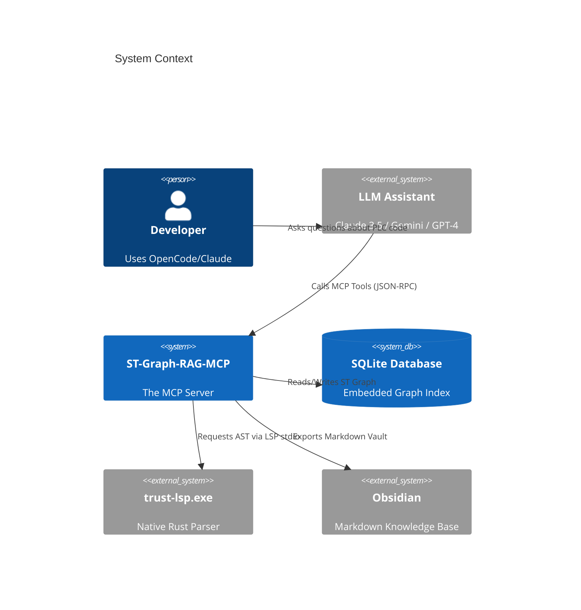

# Architecture Reference

This document outlines the internal architecture of **ST-Graph-RAG-MCP** (v3.0).

## System Context

The system exists to bridge the gap between standard LLMs (which understand C/Python/JS well but struggle with massive, cross-referenced PLC projects) and IEC 61131-3 Structured Text codebases.

## Internal Components

The TypeScript application is strictly modularized:

### 1. MCP Layer (`src/mcp/`)
Handles the Model Context Protocol lifecycle.
- **`st-tools.ts`**: The registry mapping 21 string names to their Zod schemas and handler functions.
- **`dispatcher.ts`**: Safely invokes handlers and normalizes output arrays.
- **`workspace-manager.ts`**: A singleton that manages the lifecycle of the underlying SQLite connection and LSP process per workspace directory.
- **`handlers/`**: The domain logic for every tool (Core, Analysis, Advanced, SQL-Graph, Utility).

### 2. Indexing Pipeline (`src/st/`)
Responsible for reading `.st` files and converting them into graph nodes.
- **LSP Client (`src/lsp/client.ts`)**: A custom JSON-RPC implementation over `node:child_process` (spawned via Bun) that speaks the Microsoft LSP protocol.
- **4-Stage Pipeline (`src/st/pipeline/`)**:
  1. `lspOpenStage`: Opens the document in the Rust server and polls for readiness.
  2. `parseStage`: Sends `textDocument/documentSymbol` to extract POUs (Programs, Function Blocks) and variables.
  3. `extractStage`: Resolves `CALLS`, `EXTENDS`, and `IMPLEMENTS` edges via regex fallback and LSP `callHierarchy`.
  4. `persistStage`: Uses the Unit of Work to batch insert the AST into SQLite.

### 3. Storage Layer (`src/storage/`)
The persistence boundary.
- **`sqlite-database.ts`**: Owns the DDL (schema creation) and migrations (`migrateV3toV4`). Uses `bun:sqlite`.
- **Repository Pattern**: `pou-repository.ts`, `graph-repository.ts`, `metrics-repository.ts`, etc. Encapsulate complex SQL queries (like recursive CTEs for `call_chain`) behind clean TypeScript interfaces.
- **Unit of Work**: Ensures multi-table insertions (e.g., adding a POU and its variables simultaneously) are atomic.

### 4. Obsidian Exporter (`src/obsidian/`)
The visual rendering engine.
- Reads from the Storage Layer.
- Constructs YAML frontmatter via `frontmatter-builder.ts`.
- Resolves cross-file relationships into Obsidian `[[wikilinks]]`.
- Uses `incremental.ts` (SHA256 caching) to only rewrite `.md` files that have structurally changed, allowing for blazingly fast re-exports (sub-10ms).

## Data Model (SQLite v4)

The core graph is represented in relational tables:

- `st_pous`: Nodes representing Programs, Function Blocks, Methods, Functions.
- `st_types`: Nodes representing ENUMs, STRUCTs, DUTs.
- `st_variables`: Properties attached to POUs.
- `st_relationships`: The Edges. Contains `from_id`, `to_id`, and `type` (`CALLS`, `USES_TYPE`, `EXTENDS`, `IMPLEMENTS`).

Because it's a standard SQLite DB, power users can query `.code-graph-rag/st-graph.db` directly using any SQL client.
