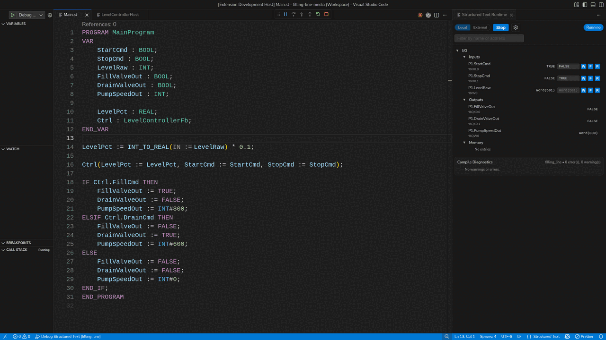

# truST — open IEC 61131-3 control workspace


[](https://johannespettersson80.github.io/trust-platform/)
[](https://marketplace.visualstudio.com/items?itemName=trust-platform.trust-lsp)
[](https://github.com/johannesPettersson80/trust-platform/releases/latest)
[](https://github.com/johannesPettersson80/trust-platform/actions/workflows/ci.yml)
[](LICENSE-MIT)
[](Cargo.toml)

Documentation: <https://johannespettersson80.github.io/trust-platform/>

truST is an open IEC 61131-3 control workspace: one project edited in VS Code,
run by `trust-runtime`, observed through browser HMI, automated through product
CLI, Agent APIs, and `trust-dev` workbench tools, connected through truST Mesh,
and assisted by AI tools that can read diagnostics and use typed truST surfaces.

Runs on Linux, including [PREEMPT_RT soft-real-time deployments](docs/public/operate/preempt-rt.md),
macOS, Windows, and Raspberry Pi.



The same runtime also serves a browser IDE at `/ide` and an operator HMI at
`/hmi`, so one project drives engineering, automation, and operation without
separate project copies to reconcile.

Read [One Project, Every Surface](docs/public/concepts/one-project.md) for the
surface map and AI/tooling boundaries. Runtimes connect to each other and to
plant systems through [truST Mesh](docs/public/concepts/trust-mesh.md): one
runtime, the right wire for each job.

## Docs

- [Install truST](docs/public/start/installation.md)
- [What is truST?](docs/public/index.md)
- [Program in VS Code](docs/public/start/program-in-vscode.md)
- [Program with examples, I/O, communication, HMI, and AI](docs/public/develop/index.md)
- [Operate in Browser HMI](docs/public/start/operate-in-browser.md)
- [Hardware support](docs/public/hardware/index.md)
- [Reference](docs/public/reference/index.md)

## Features

- IEC-aware diagnostics, formatting, rename, navigation, and refactors
- Editor AI tools for typed diagnostics, navigation, file edits, HMI work,
  telemetry, settings, and debug actions
- Runtime panel with live values, memory, and I/O inspection
- Debugger with breakpoints, stepping, locals, and call stack
- Browser IDE and operator HMI backed by the same project/runtime
- CLI, Agent API, deterministic test, and harness workflows
- truST Mesh for runtime-to-runtime and plant connectivity
- PLCopen XML import/export and visual editor support

## Install

1. Install `truST LSP` from the VS Code Marketplace.
2. Download released binaries from the latest GitHub release if you need the runtime and debugger locally.
3. Open the docs site for guided setup, examples, and target-host instructions.

Command-line extension install:

```bash
code --install-extension trust-platform.trust-lsp
```

## Components

| Component | Binary | Purpose |
|---|---|---|
| Language Server | `trust-lsp` | Diagnostics, navigation, formatting, refactors |
| Runtime | `trust-runtime` | Runtime execution engine, CLI workflows, web UI |
| Developer Workbench | `trust-dev` | Developer/workbench commands such as agent, test, docs, and project commit helpers |
| Debug Adapter | `trust-debug` | DAP debugging |
| Bundle Tool | `trust-bundle-gen` | STBC bundle generation |

## Status

- VS Code Marketplace: live
- GitHub Releases: live
- Supported platforms: Linux, Linux PREEMPT_RT, macOS, Windows, Raspberry Pi
- Runtime + debugger: pre-1.0, behavior-locked by tests
- Rust MSRV: 1.95+

## Help

- GitHub Issues: <https://github.com/johannesPettersson80/trust-platform/issues>
- Email: <johannes_salomon@hotmail.com>
- LinkedIn: <https://linkedin.com/in/johannes-pettersson>

## License

Licensed under MIT OR Apache-2.0. See `LICENSE-MIT` and `LICENSE-APACHE`.
